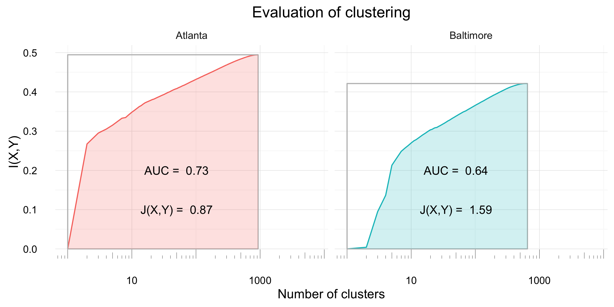
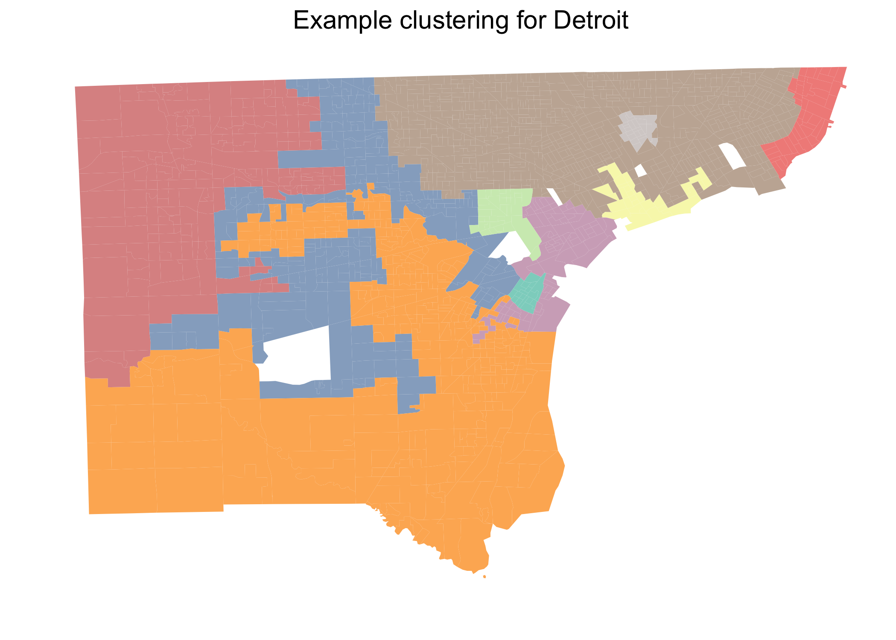
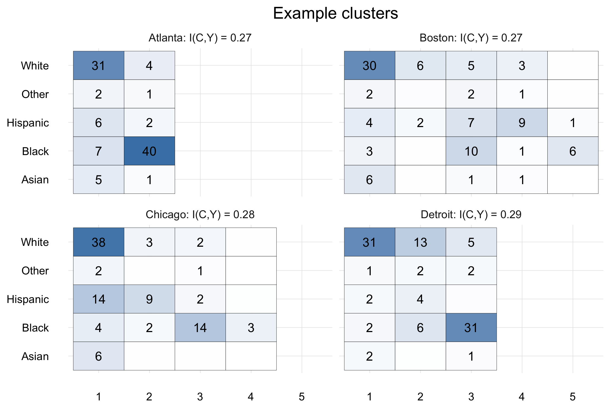
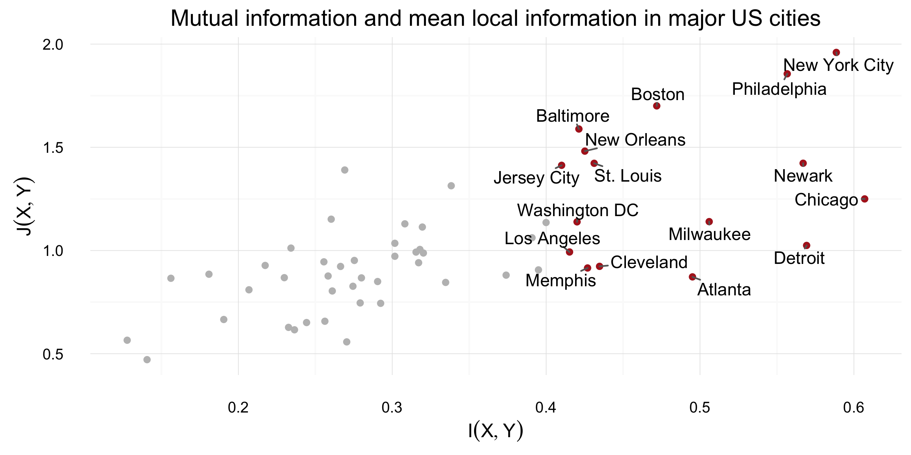

```{r echo = FALSE}
knitr::opts_chunk$set(cache = TRUE, warning = FALSE)
```


# The Grammar of Graphics

## Grammars, ingredients, and pastries

A **grammar** is a set of components (ingredients) that you can combine to create new things. Many grammars have **required components**: if you're missing one, you're doing it wrong. Think a noun and a verb in English grammar, or in baking....

<div class="columns-2">

- **A body** -- typically some kind of flour)
- **Binder** -- eggs, oil, butter, or applesauce
- **A rising agent** -- yeast, baking soda, baking powder
- **Flavoring** -- sugar, salt, chocolate, vanilla

```{r, out.height = 200, fig.retina = NULL, echo = FALSE}
knitr::include_graphics("http://www.hoteliermiddleeast.com/pictures/640x422/pastry-1-web.jpg")
```

</div>

## The Grammer of Graphics

- Puts the `gg` in `ggplot2`. 
- Formulated by Leland Wilkinson.
- Implemented in code by Hadley Wickham.

<div class="columns-2">
```{r, out.height = 400, fig.retina = NULL, echo = FALSE}
knitr::include_graphics("http://ecx.images-amazon.com/images/I/41ZIHtc9TJL._SX327_BO1,204,203,200_.jpg")
```

```{r, out.height = 400, fig.retina = NULL, echo = FALSE}
knitr::include_graphics("http://pix-media.s3.amazonaws.com/blog/1001/HadleyObama2.png")
```
</div>

## Ingredients of a data visualization 


- **Data**: in `ggplot2`, almost always a `data.frame` object. 
- **Aes**thetic mapping: relation of data to chart components.
- **Geom**etry: specific visualization type? E.g. line, bar, or (ugh) pie? 
- **Stat**istical transformation: how should the data be transformed or aggregated before visualizing?
- **Theme**: how should the non-data parts of the plot look?
- Misc. other options. 

**Data, aesthetics, and geometries** are the required grammatical components that you always need to specify. 


## `ggplot2` Personal Mini-Gallery
<div class="columns-2">

```{r, out.height = 250, out.width= 350, fig.retina = NULL, echo = FALSE}

```

```{r, out.height = 250, out.width= 350, fig.retina = NULL, echo = FALSE}

```

```{r, out.height = 250, out.width= 350, fig.retina = NULL, echo = FALSE}

```

```{r, out.height = 250, out.width= 350, fig.retina = NULL, echo = FALSE}

```

</div>

# Introductory Example

## Libraries and data: 

```{r message = FALSE}
library(ggplot2)
library(dplyr)
library(tidyr)
library(nycflights13)
```

We've already played with this data set a bit. Let's build a chart! 


## First example

It will be a bit slow to work with the complete data set (300K rows), so let's just grab a random 10K. 

```{r}

data <- flights[sample(1:nrow(flights), 10000),]
 
```

Now let's step through building a basic plot. 

## First example

```{r, fig.height=8}
### <b>
ggplot(data) # initialize plot: nothing on it. 
### </b>

```

## First example

```{r}

ggplot(data) + # initialize plot: nothing on it. 
### <b>
aes(x = distance, y = air_time) # x axis will have distance, etc. 
### </b>
# *
# stuff?

```


## First example

```{r, fig.height=4}

ggplot(data) + # initialize plot: nothing on it. 
aes(x = distance, y = air_time) + # x axis will have distance, etc. 
### <b>
geom_point() # the kind of plot we want
### </b>
# *

```


## First example

```{r, fig.height=4}

ggplot(data) + # initialize plot: nothing on it. 
aes(x = distance, y = air_time) + # x axis will have distance, etc. 
geom_point() + # the kind of plot we want
### <b>
aes(color = carrier) # add a new aes
### </b>
```


## Aesthetics and Geometries

In the grammer of English, there are lots of grammatically correct combinations, but not all of them make sense. 

1. I walked a dog. 
2. I walked a bicycle. 
3. I walked a healthcare.  

Same deal in the grammar of graphics. 

## Aesthetics

```{r}
p <- ggplot(data) + aes(x = carrier, y = distance, color = carrier) 
### <b>
p + geom_point() # not very good
### </b>
```

## **Aes**thetics and **Geom**etries
```{r}
p <- ggplot(data) + aes(x = carrier, y = distance, color = carrier) 
### <b>
p + geom_bar(stat = 'identity') # What happened?....
# stat = 'identity' summed up all the distances....
###</b>
```
## **Aes**thetics and **Geom**etries

```{r}
p <- ggplot(data) + aes(x = carrier, y = distance, color = carrier) 
### <b>
p + geom_boxplot() # better! 
###</b>
```

## **Aes**thetics and **Geom**etries

```{r}
p <- ggplot(data) + aes(x = carrier, y = distance, color = carrier) 
### <b>
p + geom_violin() # ooooh..... 
###</b>
```

## **Aes**thetics and **Geom**etries {.smaller}
Changing the `aes` changes what `geom`s are appropriate. 
```{r message = FALSE, fig.height = 4}
p <- ggplot(data) + aes(x = dep_delay, y = arr_delay, color = carrier) 
### <b>
p + geom_point(alpha = .3) # Now geom_point() makes a lot more sense! 
# Setting alpha adds transparency.
###</b>
```

## Exercise 1

Open up `dash_example.Rmd` and find the chunk labeled `make_barchart`. Click   to run all the code up to that point in the R terminal. You may want to use `glimpse(barchart_data)` to take a look at the data you'll be plotting. 

Make a barchart called `p` by typing in the following code. Inspect `p` after each new line, like we did in the previous slides. 

```{r eval = FALSE}
p <- ggplot(barchart_data) +
	aes(x = Destination, y = `Number of Departing Flights`) +
	geom_bar(stat = 'identity') + # add a position = 'fill' arg if you want 100% bars. 
	aes(fill = Origin) 
```

## Multiple aesthetics and geoms

You may often want to *combine* multiple geoms and aesthetics. Examples: 

1. `geom_point()` +  `geom_text()` = labeled scatterplot.
2. `geom_bar()` + `geom_path()` (linechart) = two-trend viz
3. `geom_point()` + `geom_path()` = segmented linechart. 

You may need to add new aesthetics as you add new geoms. In some cases, you may want your additional geoms to be built on entirely different data sets. This is surprisingly easy to do, but we won't talk about it today. 

Let's do that third one together. 

## Exercise 2

Find the chunk labeled `make_linechart`. Run the code up to that point and inspect `linechart_data`. We are going to visualize arrival and departure delays over time. 

1. Make a scatterplot (`geom_point()`) called `p` with `month` on the x-axis and `delay` on the y-axis.  
2. Add `geom_path()`. What happens? 
3. Add ```aes(group = `Arrival or Departure`)```. What happens? 
4. Add ```aes(color = `Arrival or Departure`) ``` to prettify. 
5. Feel free to uncomment the supplied code block to prettify further.  

## Small multiples

*At the heart of quantitative reasoning is a single question: **Compared to what?** Small multiple designs, multivariate and data bountiful, answer directly by visually enforcing comparisons of changes, of the differences among objects, of the scope of alternatives.* - Edward Tufte

Simple idea: repeat the same plot many times for each condition of a categorical variable. 

## Small multiples example: one variable

```{r, fig.height = 4}

ggplot(data) + # initialize plot: nothing on it. 
	aes(x = distance, y = air_time) + # x axis will have distance, etc. 
	geom_point() + # the kind of plot we want
	aes(color = carrier)  # add a new aes
```

## Small multiples example: one variable

```{r, fig.height = 4}

ggplot(data) + # initialize plot: nothing on it. 
	aes(x = distance, y = air_time) + # x axis will have distance, etc. 
	geom_point() + # the kind of plot we want
	aes(color = carrier) + # add a new aes
### <b>
	facet_wrap(~carrier) # use facet_wrap for faceting with one variable
### </b>
```

## Small multiples example: two variables

```{r, fig.height = 4}

ggplot(data) + # initialize plot: nothing on it. 
	aes(x = distance, y = air_time) + # x axis will have distance, etc. 
	geom_point() + # the kind of plot we want
	aes(color = carrier) + # add a new aes
### <b>
	facet_grid(origin~carrier) # use facet_grid for more than one. 
### </b>
```

## Exercise 3

Find the code chunk `make_boxplot` and run the code up to it. Peak at `boxplot_data`. We are going to plot variations in distance travelled by month and carrier. 

1. Make a boxplot (`geom_boxplot()`) called `p` with `month` on the x-axis and `distance` on the y axis. 
2. Use `facet_wrap` to create a facet for each carrier. 
3. Feel free to uncomment the supplied code chunk to prettify. 

# Resources and Notes

## Helpful links

- Winston Chang's [R Graphics Cookbook](http://www.cookbook-r.com/Graphs/)
- The `ggplot2` [cheatsheet](https://www.rstudio.com/wp-content/uploads/2015/03/ggplot2-cheatsheet.pdf)
- Jenny Bryan's excellent [teaching materials](http://stat545.com/graph00_index.html) on `ggplot2`
- The official `ggplot2` [homepage](http://ggplot2.org/)
- The `ggplot2` [docs](http://docs.ggplot2.org/current/)

# Appendix: Tidy Data and Visualization

## Hadley on tidy data

"The two most important properties of tidy data are:

- Each column is a variable.
- Each row is an observation.

"Arranging your data in this way makes it easier to work with because you have a consistent way of referring to variables (as column names) and observations (as row indices). When you use tidy data and tidy tools, you spend less time worrying about how to feed the output from one function into the input of another, and more time answering your questions about the data."

- [Source](https://blog.rstudio.org/2014/07/22/introducing-tidyr/)

## Problems with `ggplot2` are often tidy data problems {.smaller}

If `ggplot2` isn't giving you the plot structure that you want, it's easy to assume that you have a **data visualization problem**. 

In fact, it is likely that your problem is  actually  a **data manipulation problem**. Example:  

```{r echo = FALSE}
data <- flights %>% group_by(carrier, origin) %>%
	summarise(n = n()) %>%
	spread(key = origin, value = n, fill = 0) %>%
	ungroup() 
```

```{r}
head(data)
```

I'd like a stacked barchart with carriers on the x-axis, and different colors for the origin airport in NY. Easy, right? 

## Let's try it! 

```{r eval = FALSE}

ggplot(data) + 
	aes(x = carrier, y = n, fill = origin) + 
	geom_bar(stat = 'identity')

```

```{r echo = FALSE} 
print("Error in eval(expr, envir, enclos) : object 'origin' not found")
```

`ggplot2` needs there to be a **column** specifying the origin. My data isn't tidy!

## Solution: reshape the data with `tidyr::gather`

```{r}

plot_data <- data %>% 
	### <b>
	gather(key = 'origin', value = n, -carrier)
	### </b>

head(plot_data)
```

## Now our barchart works

```{r}

ggplot(plot_data) + 
	aes(x = carrier, y = n, fill = origin) + 
	geom_bar(stat = 'identity')

```

## Learnings

The shape and structure of your data matters! Tools like `dplyr` and `tidyr` are key here. 

- `tidyr` [vignette](https://cran.r-project.org/web/packages/tidyr/vignettes/tidy-data.html)
- `dplyr` [vignette](https://cran.rstudio.com/web/packages/dplyr/vignettes/introduction.html)
- [Jenny Bryan](http://stat545.com/block016_secrets-happy-graphing.html) on "Secrets of a Happy Graphing Life". Her rules: 

	- Keep stuff in `data.frames`
	- Keep your `data.frames` *tidy*; be willing to reshape your data often
	- Use factors and be the boss of them
